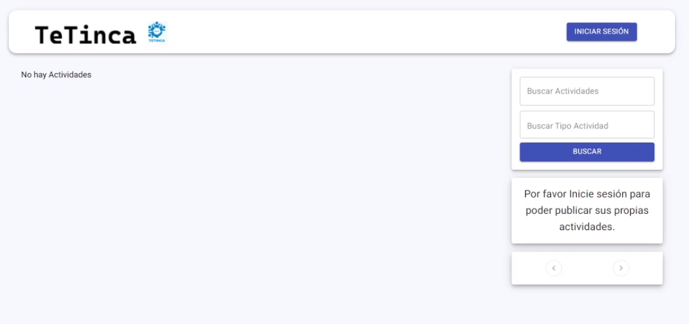
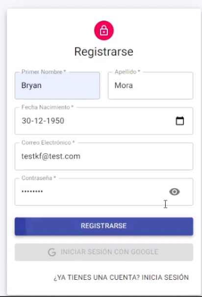
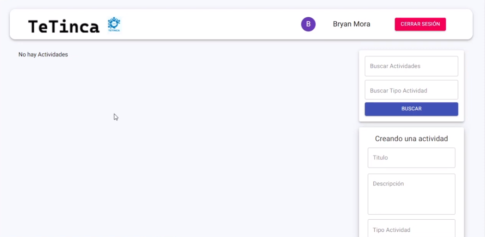
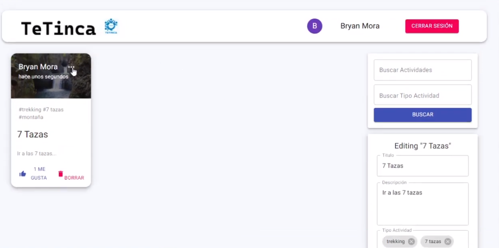
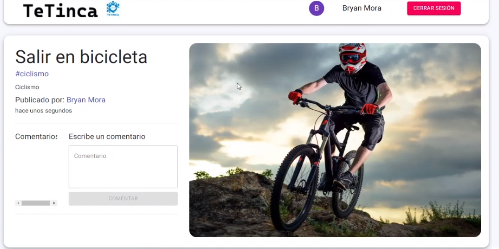
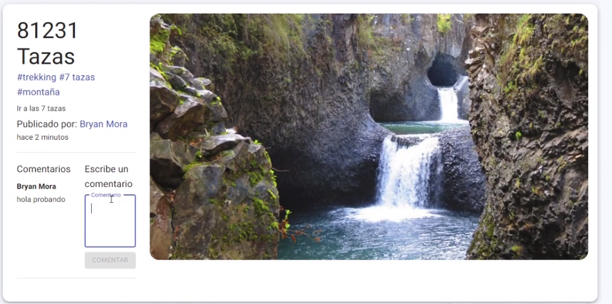

## Red Social para publicar, buscar y participar en actividades

```console
Instalación:
- ejecutar "npm i && npm start" desde el lado de cliente y servidor para ejecutar
```

## Home sin publicaciones



## Sección de registro usuarios



## Home con sesión iniciada



## Home con actividades creadas



## Panel de editar actividades 1



## Panel de editar actividades 1


